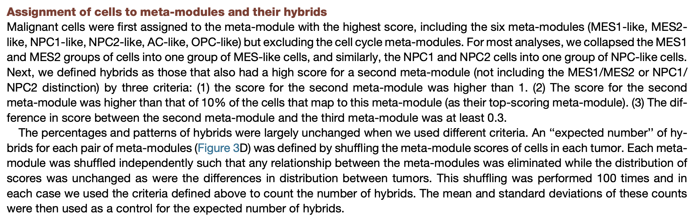

# Scalop to annotate data

### Installation
- Requirements: Docker. E.g. I have `Docker version 26.1.3, build 26.1.3-0ubuntu1~22.04.1` installed. 
- Open the folder in the container. cmd + shift + P: "Dev Containers: Rebuild and Reopen in Container"

- If you do not want to use docker, you can install this version of the code as a package using:
```python
install.packages("remotes")
remotes::install_github("JeanRadig/scalop")
```

### Load an h5ad file using zellkonverter
We enable loading of h5ad data via usage of zellkonverter library.  

### Assignment of cells to meta-modules: check `vignettes/03_annotate_cell_states.ipynb` 
From: https://doi.org/10.1016/j.cell.2019.06.024.

<div style="text-align: center; margin-top: 20px; margin-bottom: 20px;">
    
</div>

The assignment is dependent on the scores obtained in your dataset. The thresholds are set manually. You need to observe the scores that you get on your dataset and decide for the thresholds accordingly. Go to `vignettes/03_annotate_cell_states.ipynb` to see the pipeline from loading an h5ad to annotate the cells. 

Note that in the Neftel paper they obtained scores that were higher than one on at least one cell state for each cell. It was not unusual for them to have cells with a second state with a score above. See their results at [IDHwt.GBM.Metadata.SS2.txt](https://singlecell.broadinstitute.org/single_cell/study/SCP393/single-cell-rna-seq-of-adult-and-pediatric-glioblastoma#study-download). We suppose they would then set `maxcol_strict(scores, min=1.2, diff=1)`. In our case, 70% of the cells had a score above 0.3. We therefore set `maxcol_strict(scores, min=0.3, diff=0.1)`. 